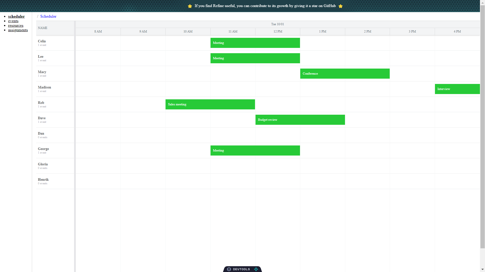

# Create a Bryntum Scheduler component in a Refine application using NextJS

The starter repository uses [Refine.dev](https://refine.dev/) for CRUD operations.
A local SQLite data is used as the data store. 
The code for the complete app is on the `completed-scheduler` branch.

## Getting started

Install the dependencies by running the following command: 

```sh
npm install
```

Install the Bryntum Scheduler component by first getting [access to npm registry](https://bryntum.com/products/scheduler/docs/guide/Scheduler/quick-start/react#access-to-npm-registry) then [install the Bryntum Scheduler packages](https://bryntum.com/products/scheduler/docs/guide/Scheduler/quick-start/react#install-bryntum-scheduler-packages).

Populate a local SQLite database with the example data in `src/initialData`:

```shell
node src/addExampleData.js
```

## Running the app

Run the local dev server using the following command:

```sh
npm run dev
```

You'll see a Bryntum Scheduler with 5 tasks and 10 resources:

